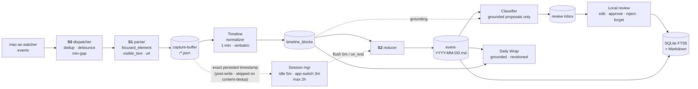

<p align="center">
  
</p>

<h1 align="center">OpenChronicle</h1>

<p align="center">
  Open-source, local-first memory for any tool-capable LLM agent.
</p>

<p align="center">
  Think OpenAI Chronicle - but open, model-agnostic, inspectable, and hackable.
</p>

---

<p align="center">
  <a href="https://star-history.com/#Einsia/OpenChronicle&Date">
    <picture>
      <source
        media="(prefers-color-scheme: dark)"
        srcset="https://api.star-history.com/svg?repos=Einsia/OpenChronicle&type=Date&theme=dark"
      />
      <source
        media="(prefers-color-scheme: light)"
        srcset="https://api.star-history.com/svg?repos=Einsia/OpenChronicle&type=Date"
      />
      
    </picture>
  </a>
</p>

> **Status:** v0.1.0 · macOS only · early alpha

> **This fork:** see the [official-source Vida product research](docs/vida-public-product-research.md), the clean-room [Vida-like proactive assistant roadmap](docs/vida-like-roadmap.md), the [Stage 1 memory/Daily Wrap contract](docs/stage1-memory-daily-wrap.md), and the [trusted desktop-shell boundary](docs/desktop-shell.md).

OpenChronicle gives AI agents a local, inspectable memory built from real screen and app context.

It runs on your Mac, captures structured context from what you're doing, and turns it into persistent Markdown memory: what you're working on, what you've decided, which tools you use, and which people or projects matter.

Any agent that can call tools can use it. MCP clients work especially well today, but OpenChronicle is meant to be a general memory layer for tool-using agents - not something tied to one protocol, one model provider, or one app.

---

## Why OpenChronicle

OpenAI Chronicle points to an important future: agents that remember your real working context.

OpenChronicle is our open alternative:

- **Local-first** - memory stays on your machine
- **Model-agnostic** - use Ollama, LM Studio, OpenAI, Anthropic, or any LiteLLM-compatible provider
- **Tool-friendly** - usable by any tool-capable agent
- **Inspectable** - Markdown on disk, SQLite locally
- **Open** - MIT-licensed and built to be extended

---

## Why AX-first

OpenChronicle currently prioritizes **AX Tree / accessibility-tree context** as its primary signal, with screenshots as a secondary signal over time.

We think this is the right tradeoff for an early memory system:

- **Lower cost** - structured text is far cheaper to process than screenshot-heavy OCR / vision pipelines
- **Better intent capture** - AX is often better for active app, focused element, edited text, URL, and interaction state
- **Smaller, cleaner memory** - easier to deduplicate, normalize, index, and retain long-term
- **Better foundation** - screenshots can later enrich visual context where AX falls short

> **AX-first for accurate, compact, low-cost memory; screenshot-assisted for richer multimodal context.**

### Capture privacy boundary

The Stage 0 implementation is designed to fail closed unless Accessibility and
CoreGraphics can agree on one exact focused window. Schema versions 4 and 5
bind the app, bundle ID, title, PID, `CGWindowID`, and bounds before AX content
can be persisted. Secure text-field values are replaced with `[REDACTED]`
inside the native helper, before Python sees them.

Browser URL allow/exclude rules are bounded literals, not regular expressions.
They run after in-memory AX extraction but before screenshots, JSON, FTS, or
model use. Active URL policy supports only known browser bundles with a
family-specific address-control adapter; other apps are denied before AX
collection. The privacy gate requires exactly one address value from an exact
stable AX identifier. A bounded scan of the rest of the tree is an additional
deny surface, never substitute address evidence. The native helper must provide
a receipt proving an unpruned tree, and two snapshots must retain the same
window and URL evidence. This reduces navigation races but is not an atomic
browser transaction.

A successful URL-policy observation uses the `url_metadata_only` profile: it
retains only app/bundle/PID/`CGWindowID`/bounds metadata and an explicitly
observed, approved HTTP(S) URL. Raw AX, focused content, and screenshots are
omitted; visible text and titles are cleared. A scheme-less address is checked
under both HTTP and HTTPS interpretations, remains `null` in S1, and is rejected
as durable URL-policy evidence. The retained value is address-control evidence,
not proof that the browser loaded that document. Outside URL policy, screenshots
remain opt-in and target one exact CoreGraphics window, with no display-capture
or `mss` fallback. Watcher content
details never enter persistence or session hooks. See [Capture](docs/capture.md)
and [Configuration](docs/config.md) for the complete contract.

This describes implementation status, not completed live acceptance. The
unlocked, real-application Accessibility and Screen Recording audit remains
open in [#3](https://github.com/chimeraHHH/OpenChronicle/issues/3); exact-window
privacy is not release-validated until that audit is recorded and reviewed.

---

## OpenChronicle vs OpenAI Chronicle

|                     | OpenAI Chronicle                | **OpenChronicle**                              |
| ------------------- | ------------------------------- | ---------------------------------------------- |
| Source              | Closed                          | **MIT, open-source**                           |
| Model choice        | OpenAI-centric                  | **Your choice**                                |
| Who can use it      | Product-specific workflow       | **Any tool-capable agent**                     |
| Primary capture     | Screenshot / OCR-heavy          | **AX Tree first**, screenshot-assisted         |
| Storage             | Local generated memories        | **Markdown + SQLite on your machine**          |
| Extensibility       | Limited                         | **Hackable parsers, memory logic, integrations** |

---

## How it works



The core idea is simple:

1. capture context
2. compress it into sessions
3. extract durable facts
4. review grounded memory candidates
5. store approved memory locally and generate an evidence-backed Daily Wrap
6. let agents query memory, wraps, and provenance through read-only tools

---

## What you get

* **Event-driven capture** from macOS AX events
* **Fail-closed exact-window privacy implementation** with literal browser URL
  rules and secure-field redaction; live real-application acceptance remains
  open in [#3](https://github.com/chimeraHHH/OpenChronicle/issues/3)
* **Session-aware memory writing** instead of noisy per-snapshot logs
* **Human-readable Markdown memory**
* **Local SQLite indexing**
* **Structured memory files** like user-, project-, tool-, topic-, person-, org-, reviewed text-only procedure-, and daily event- memory
* **Supersede-not-delete history**
* **Review-first durable memory candidates** with evidence, conflicts, and explicit approval
* **Canonical Daily Wraps** with exact, explicitly untrusted activity quotes,
  per-item source references, and partial-coverage reporting
* **Crash-resumable true purge** for a candidate, its accepted entry, candidate-owned target metadata/file, and derived wraps
* **Native review-shell source slice** for pause/resume, candidate review,
  read-only Daily Wraps, timeline inspection, privacy policy, and exact source lineage
* **Local or cloud model support**
* **Always-on agent-readable interface**, with MCP as the best-supported path today

---

## Install

Requires **macOS 13+** and **Xcode Command Line Tools** (`xcode-select --install`).

```bash
git clone https://github.com/Einsia/OpenChronicle.git
cd openchronicle
bash install.sh
```

---

## Run

```bash
openchronicle start
openchronicle start --foreground
openchronicle status
openchronicle pause
openchronicle resume
openchronicle stop
```

Useful inspection commands:

```bash
openchronicle capture-once
openchronicle timeline tick
openchronicle timeline list
openchronicle writer run
openchronicle memory adoptions
openchronicle memory explain-recall "editor preference" --top-k 5
openchronicle memory usefulness --json
openchronicle memory screen-adoption <adoption-id>
openchronicle memory candidates
openchronicle memory show <candidate-id>
openchronicle memory approve <candidate-id>
openchronicle provenance trace memory_entry <entry-id> --path project-example.md
openchronicle daily-wrap run --date 2026-08-06 --timezone Asia/Shanghai
openchronicle daily-wrap show --date 2026-08-06 --timezone Asia/Shanghai
openchronicle rebuild-index
```

Scheduled Daily Wrap is opt-in because it may invoke the configured model with
a hard byte-bounded evidence payload. Set `[daily_wrap] enabled = true` only after
choosing an acceptable local or cloud model; one-off `daily-wrap run` remains
explicit.

`memory screen-adoption` is also explicit model egress: it displays the
configured classifier provider before sending the exact adopted Prompt/Reply
Rescue text. A qualifying reusable workflow, checklist, or template is only
staged in the ordinary review inbox; it is never approved, published, or
executed automatically.

`memory usefulness` is the business-state-preserving outcome view for local
long-term memory. It joins an exact reviewed memory revision to Prompt Rescue
outputs and their immutable adoption records without emitting prompt, memory,
or artifact text. Normal first-run CLI initialization may still create config,
log, and SQLite schema files. Unedited adoption is reported as a descriptive
positive association; edited adoption remains ambiguous, and neither signal
changes ranking automatically.

`memory explain-recall` is the complementary local ranking view. It reports
the current BM25/vector channel ranks, cosine similarity, and RRF score without
returning memory text or echoing the raw query. It invokes no LLM, persists no
query trace, and does not change ranking. If semantic search is enabled but its
local backend is unavailable, the command reports that failure instead of
silently falling back to BM25.

---

## Connect an agent

OpenChronicle is designed for **tool-calling agents**.

### Best-supported path today: MCP

The daemon hosts an MCP endpoint at:

```bash
http://127.0.0.1:8742/mcp
```

Supported integration paths include:

* Claude Code
* Claude Desktop
* Codex
* opencode
* custom local agents
* and more...

See [docs/mcp.md](docs/mcp.md) for setup details.

---

## Contributing

We especially want help in three areas:

### 1. Better context parsers

App-specific parsing and normalization for browsers, terminals, editors, Slack, Notion, Cursor, Linear, Figma, and more.

### 2. Better memory management

Session reduction, durable-fact extraction, compaction, supersede / merge logic, and retrieval quality.

### 3. More agent integrations

Support for more MCP clients, IDE agents, coding assistants, desktop agents, and local orchestration frameworks.

If you care about local-first agents, personal AI memory, or open context infrastructure, this project is for you.

---

Documentation

* [docs/architecture.md](docs/architecture.md) - end-to-end pipeline and code layout
* [docs/config.md](docs/config.md) - configuration and model setup
* [docs/capture.md](docs/capture.md) - event-driven capture and AX details
* [docs/timeline.md](docs/timeline.md) - normalization and anti-hallucination design
* [docs/session.md](docs/session.md) - session cutting rules
* [docs/writer.md](docs/writer.md) - reducer, classifier, and retry model
* [docs/mcp.md](docs/mcp.md) - current tool surface and integrations
* [docs/memory-format.md](docs/memory-format.md) - file layout and supersede semantics
* [docs/memory-recall-explain-v1.md](docs/memory-recall-explain-v1.md) - local BM25/vector/RRF recall diagnostics and privacy boundary
* [docs/memory-usefulness-v1.md](docs/memory-usefulness-v1.md) - exact memory revision to Prompt Rescue adoption outcome report
* [docs/stage1-memory-daily-wrap.md](docs/stage1-memory-daily-wrap.md) - provenance, review inbox, Daily Wrap, privacy, and failure semantics
* [docs/desktop-shell.md](docs/desktop-shell.md) - Tauri trust boundary, fixed bridge protocol, dangerous-action semantics, and release gates
* [docs/vida-public-product-research.md](docs/vida-public-product-research.md) - dated official-source Vida capability and privacy research
* [docs/local-long-term-memory-research-2026-08-23.md](docs/local-long-term-memory-research-2026-08-23.md) - multi-agent paper/repository survey and local-memory implementation decisions
* [docs/vida-like-roadmap.md](docs/vida-like-roadmap.md) - clean-room parity plan and staged safety gates
* [docs/runtime-reliability.md](docs/runtime-reliability.md) - process fault matrix, 10k replay, and the still-open 24-hour/daemon-queue/cascade-replay gates
* [docs/troubleshooting.md](docs/troubleshooting.md) - common issues

---

## Development

```bash
uv sync --all-extras
uv run pytest
uv run ruff check

cd apps/desktop
nvm use                 # .nvmrc pins the supported Node.js LTS runtime
npm ci
npm test
npm run build
npm run tauri:dev

cd src-tauri
cargo test --locked --all-targets
cargo clippy --locked --all-targets -- -D warnings
cargo check --locked --release
```

The desktop source build intentionally is not a distributable app yet. A
self-contained, signed bridge sidecar plus notarization and macOS TCC testing
remain release gates; see [docs/desktop-shell.md](docs/desktop-shell.md).

---

## License

MIT.
## Contributors ✨

Thanks goes to these wonderful people ([emoji key](https://allcontributors.org/docs/en/emoji-key)):

<!-- ALL-CONTRIBUTORS-LIST:START - Do not remove or modify this section -->
<!-- prettier-ignore-start -->
<!-- markdownlint-disable -->
<table>
  <tbody>
    <tr>
      <td align="center" valign="top" width="14.28%"><a href="https://github.com/KMing-L"><br /><sub><b>Qianli Ren</b></sub></a><br /><a href="https://github.com/Einsia/OpenChronicle/commits?author=KMing-L" title="Code">💻</a> <a href="#maintenance-KMing-L" title="Maintenance">🚧</a></td>
      <td align="center" valign="top" width="14.28%"><a href="https://github.com/abmfy"><br /><sub><b>Bowen Wang</b></sub></a><br /><a href="https://github.com/Einsia/OpenChronicle/commits?author=abmfy" title="Code">💻</a> <a href="#maintenance-abmfy" title="Maintenance">🚧</a></td>
      <td align="center" valign="top" width="14.28%"><a href="https://github.com/calvin1376"><br /><sub><b>CrazyCalvin</b></sub></a><br /><a href="https://github.com/Einsia/OpenChronicle/commits?author=calvin1376" title="Code">💻</a></td>
      <td align="center" valign="top" width="14.28%"><a href="https://github.com/Azure-stars"><br /><sub><b>Firefly</b></sub></a><br /><a href="https://github.com/Einsia/OpenChronicle/commits?author=Azure-stars" title="Code">💻</a></td>
      <td align="center" valign="top" width="14.28%"><a href="https://github.com/Xiao-ao-jiang-hu"><br /><sub><b>校奥浆糊</b></sub></a><br /><a href="https://github.com/Einsia/OpenChronicle/commits?author=Xiao-ao-jiang-hu" title="Code">💻</a> <a href="#maintenance-Xiao-ao-jiang-hu" title="Maintenance">🚧</a></td>
      <td align="center" valign="top" width="14.28%"><a href="https://ashitemaru.github.io/"><br /><sub><b>Houde Qian</b></sub></a><br /><a href="https://github.com/Einsia/OpenChronicle/commits?author=Ashitemaru" title="Code">💻</a></td>
      <td align="center" valign="top" width="14.28%"><a href="https://github.com/GiddensF97"><br /><sub><b>GiddensF97</b></sub></a><br /><a href="#design-GiddensF97" title="Design">🎨</a></td>
    </tr>
    <tr>
      <td align="center" valign="top" width="14.28%"><a href="https://github.com/SiyiZhu1"><br /><sub><b>SiyiZhu1</b></sub></a><br /><a href="#design-SiyiZhu1" title="Design">🎨</a></td>
    </tr>
  </tbody>
</table>

<!-- markdownlint-restore -->
<!-- prettier-ignore-end -->

<!-- ALL-CONTRIBUTORS-LIST:END -->

This project follows the [all-contributors](https://github.com/all-contributors/all-contributors) specification. Contributions of any kind welcome!
