# Architecture

OpenChronicle is a single daemon that ingests capture events, compresses them through a deterministic funnel, and classifies the result into a review inbox. Explicit local approval is the only path from a candidate into durable Markdown memory.

```mermaid
flowchart LR
    W[mac-ax-watcher<br/>Swift binary]

    subgraph capture [Capture Layer]
        direction TB
        S0["<b>S0</b> event_dispatcher<br/>dedup · debounce · min-gap"]
        PF["Privacy + exact-window fence<br/>app · bundle · title · PID · CGWindowID · bounds"]
        AX["mac-ax-helper<br/>exact focused AX window"]
        S1["<b>S1</b> s1_parser<br/>focused_element · visible_text · url"]
        URL["Known-browser URL policy<br/>stable-ID address · full-tree deny"]
        META["URL metadata projection<br/>schema v5 · no AX/content/pixels"]
        NORMAL["Normal schema v4 path<br/>optional exact-window screenshot"]
        BUF[(capture-buffer/*.json)]
        S0 --> PF --> AX --> S1 --> URL --> META --> BUF
        S1 -. URL policy off .-> NORMAL --> BUF
    end

    subgraph compress [Compression Layer]
        direction TB
        TL["Timeline aggregator · LLM<br/>1-min normalized blocks<br/>verbatim-preserving"]
        BLOCKS[(timeline_blocks)]
        SM["Session manager<br/>3-rule cutter<br/>active → ended"]
        S2["<b>S2</b> session_reducer · LLM<br/>async thread"]
        TL --> BLOCKS
        BLOCKS -- read window --> S2
        SM -. trigger: flush 5m / on_session_end .-> S2
    end

    subgraph memory [Memory Layer]
        direction TB
        ED[(event-YYYY-MM-DD.md)]
        JOBS[(classifier_jobs<br/>durable outbox)]
        CLF["Classifier · LLM<br/>tool-call loop · 30 m tick + terminal"]
        CAND[(memory_candidates<br/>review inbox)]
        REVIEW["Trusted local review<br/>edit · approve · reject · forget"]
        MF[(user- · project- · tool- ·<br/>topic- · person- · org-*.md)]
        WRAP[(Daily Wrap<br/>opt-in · revisioned)]
        CMP["Compact · LLM<br/>on-demand"]
        ED --> CLF --> CAND --> REVIEW --> MF
        JOBS <--> CLF
        ED --> WRAP
        BLOCKS --> WRAP
        MF -. read / rewrite .-> CMP
        CMP -. supersede .-> MF
    end

    subgraph query [Query Layer]
        direction TB
        FTS[(SQLite FTS5<br/>entries_fts · captures_fts)]
        MCP["MCP server<br/>127.0.0.1:8742/mcp"]
        AG[Tool-capable agents<br/>Claude Code · Desktop · Cursor · Codex · …]
        FTS --> MCP --> AG
    end

    W --> S0
    BUF -. pre_capture_hook<br/>(post-write · skipped on content-dedup) .-> SM
    BUF --> TL
    S2 --> ED
    BLOCKS -. grounding .-> CLF
    MF --> FTS
    ED --> FTS
    BUF -. indexed .-> FTS
```



## Runtime sequence

A typical 5-minute flush window, showing how one AX event propagates through to durable memory:

```mermaid
sequenceDiagram
    participant W as mac-ax-watcher
    participant S0 as S0 dispatcher
    participant P as Privacy / WindowMeta
    participant AX as mac-ax-helper
    participant S1 as S1 parser
    participant CG as CoreGraphics screenshot
    participant BUF as capture-buffer
    participant SM as Session mgr
    participant TL as Timeline tick
    participant R as S2 reducer
    participant JOB as Classifier outbox
    participant CLF as Classifier
    participant DB as SQLite + memory/
    participant MCP as MCP / agent

    W->>S0: AX event
    S0->>S0: debounce / dedup / min-gap
    S0->>P: schedule capture runner (threaded)
    P->>P: validate policy + exact focused<br/>PID / CGWindowID / bounds
    P->>P: URL rules: reject unsupported bundle before AX
    P->>AX: focused-window-only AX capture
    AX-->>P: one frontmost app/window<br/>identity + completeness receipt
    P->>S1: enrich AX in memory
    S1->>P: focused element / visible text / URL
    P->>P: URL rules: stable-ID address + full-tree deny<br/>repeat complete snapshot and compare evidence
    P->>P: URL rules: project to URL/identity metadata only
    Note over P,AX: Two reads mitigate navigation races;<br/>they are not an atomic browser transaction
    opt screenshots enabled and URL policy disabled
        P->>CG: exact CGWindowID + expected identity
        CG-->>P: verified JPEG + final identity
        P->>P: final focused-window identity check
    end
    P->>BUF: private normal v4/v2 or URL-metadata v5/v3 JSON
    Note right of BUF: content-fingerprint dedup<br/>drops consecutive duplicates
    BUF->>SM: pre_capture_hook → on_event<br/>(post-write · skipped on content-dedup)

    Note over TL,BUF: timeline tick · every 60 s
    TL->>BUF: scan closed 1-min windows
    TL->>DB: LLM → insert timeline_blocks

    Note over SM,R: flush tick · every 5 min
    SM->>R: reduce(flush_end → now)
    R->>DB: read blocks · LLM · append [flush] entry
    R->>SM: advance flush_end

    Note over SM,JOB: classifier cadence · default 30 min of proven flush coverage
    SM->>JOB: request/coalesce periodic job through flush_end
    JOB->>CLF: claim frozen window + token/expiry lease
    CLF->>DB: read exact covered entries<br/>+ timeline_blocks; bind evidence digest
    CLF->>JOB: renew around provider calls
    CLF->>DB: lease/source-fenced candidate proposals
    CLF->>JOB: explicit typed commit/skip receipt
    JOB->>SM: atomically finalize classified_end + succeeded

    Note over CLF,DB: later, explicit trusted local review
    DB->>DB: revalidate evidence → deterministic Markdown write

    Note over SM,CLF: on_session_end<br/>(idle / soft-cut / timeout / shutdown / 23:55)
    SM->>R: terminal reduce (full trailing range)
    R->>DB: deterministic final entry or durable zero-block proof
    R->>SM: mark reduced + exact-entry/typed-empty intent
    SM-->>JOB: callback or recovery scan requests terminal job
    JOB->>CLF: claim exact-entry delivery

    Note over MCP,DB: any time
    MCP->>DB: FTS search / list / read
    DB-->>MCP: results
```

## Tasks in the daemon

Defined in `src/openchronicle/daemon.py`.

| Task | Purpose |
|---|---|
| `capture` | Consumes bounded, identity-only watcher events and requires one exact focused-window identity across native metadata and AX collection. App/window policy runs before AX. Active URL policy rejects unsupported bundles before AX; a known browser adapter then requires one explicit HTTP(S) address from an exact stable identifier, a complete-tree receipt, a full-tree deny scan, and matching evidence from two snapshots. Successful URL observations are schema-v5/policy-v3 `url_metadata_only`: URL and identity only, with raw AX/focused content/pixels omitted and text/titles cleared. The two reads reduce but cannot atomically eliminate browser navigation races. With URL policy off, optional pixels target only the verified `CGWindowID`. Any required-stage failure drops the observation; only a successful private JSON reaches `SessionManager.on_event`. Heartbeat catches quiet periods. |
| `timeline` | Every 60s scans closed wall-clock windows (default 1 min), runs the `timeline` LLM stage for populated windows, and records the inspected interval `[processed_from, processed_through)` (bucket-end proof `(processed_from, processed_through]`) across populated and proven-empty windows. A cold start backfills retained captures/pending sessions in bounded pages. Cleans buffer files only behind the valid upper bound. |
| `session` | Every `session.tick_seconds` (default 30), calls `SessionManager.check_cuts()` so idle-gap and timeout cuts fire even when the dispatcher is quiet. |
| `flush` | Every `session.flush_minutes` (default 5, clamped to 5-min floor), runs the reducer incrementally over the active session's newly closed timeline blocks (~5 of them at defaults) and appends `[flush]`-tagged partial entries to today's event-daily. |
| `classifier-tick` | Polls every 5–60 seconds. When an active session has at least `classifier.interval_minutes` (default 30, min 5) of unclassified, durably flushed coverage, requests/coalesces a periodic job through `flush_end`; also recovers terminal intents and drains committed, pending, expired-running, and due-failed jobs. |
| `pending-reducer` | Every 60s retries durable `ended`/due-`failed` rows. A terminal callback that beats the timeline producer remains `ended` until its final bucket lies inside the producer's durable coverage range. |
| `daily-safety-net` | Once per local day at `reducer.daily_tick_hour:minute` (default 23:55), force-ends the currently-open session and reduces every stranded `ended`/`failed` session row — the "we survived a crash or midnight rollover" safety net. |
| `daily-wrap` | Opt-in worker (disabled by default). After the configured post-midnight time, synthesizes the previous IANA-local day, retries/rechecks within the late-data grace window, and revises one canonical grounded wrap. Provider calls run on cancellable dedicated daemon threads; shutdown revokes the matching lease without waiting for a stuck provider. |
| `mcp` | Hosts the Reader MCP server inside the daemon. Exponential backoff on crash. |

The session cutter itself does not have a dedicated task — it runs inline on every persisted, non-duplicate watcher or heartbeat capture via the `pre_capture_hook` wired in `daemon.py`. Ordinary session-end callbacks spawn the reducer on a daemon thread; graceful shutdown persists the same `ended` row but deliberately leaves dispatch to the next lease holder. If the final timeline bucket is still pending, the durable row stays queued for `pending-reducer`. A successful terminal write persists its exact entry identity and an owed-classification bit before any callback. The callback accelerates outbox recovery but is not required for correctness. `flush_end` proves reducer materialization; `classified_end` records only finalized, contiguous classifier coverage.

The daemon also holds a private singleton file lease for its entire lifetime.
CLI `status`/`stop` trust `.pid` only while that lease is held, so a PID reused
after `SIGKILL` cannot cause an unrelated process to be reported or signalled.
Before optional workers start, every normal daemon launch resumes any authorized
memory purge tombstones. This recovery is independent of Daily Wrap enablement.

`--capture-only` is a strict no-model ingestion/debug mode: it disables the
timeline, reducer/flush, classifier, and MCP paths. Capture, session bookkeeping,
and the daily safety-net still run so session rows land on disk.

## Capture privacy and pixel boundary

`window_meta.py` does not infer a window from app order, title alone, or a
display crop. The native helper joins AX's focused window to the ordered
CoreGraphics list and returns one versioned `WindowMeta`: app name, bundle ID,
title, PID, `CGWindowID`, and bounded global geometry. Ambiguity, missing
fields, invalid geometry, permission denial, and focus changes all fail closed.
The AX helper carries that identity through focused-window-only traversal and
Python accepts only one frontmost app and one focused window with the same
identity.

S1 runs only in memory until URL policy is resolved. URL configuration is
validated before native collection, and an active policy accepts only known
browser bundle/family adapters; unknown browsers and ordinary apps are denied
before AX. A family adapter must find exactly one explicit HTTP(S) value in a
browser-chrome control by exact stable AX identifier. Normal S1 extraction may
fall back to an exact label, but policy cannot. A separate bounded full-tree
scan evaluates every URL-like value as an additional deny surface; page content
can deny but never grant address evidence. Scheme-less evidence is checked
under both HTTP and HTTPS interpretations, remains `null` in S1, and is rejected
as durable URL evidence.

The helper must return a versioned receipt proving an unpruned focused-window
tree at the effective depth. A second complete AX snapshot must retain the same
exact window identity and address/full-scan evidence, including provenance and
AX source paths. This reduces ordinary navigation races but does not provide an
atomic browser transaction. On success the raw snapshots remain ephemeral:
schema v5 / policy v3 `url_metadata_only` persistence retains app, bundle, PID,
`CGWindowID`, bounds, and the approved explicit URL; it omits AX/focused content
and pixels and clears titles and visible text. Secure AX values are redacted in
Swift and again at the Python boundary before this projection. The retained URL
is evidence of an editable address-control value, not a browser navigation
receipt; a stable typed-but-unsubmitted URL can therefore describe a different
document from the page that was loaded.

Screenshots are opt-in. The helper preflights Screen Recording permission
without opening a consent prompt and asks CoreGraphics for an image of an array
containing exactly the expected `CGWindowID`. It verifies identity before
capture, after capture, and after JPEG encoding; Python validates dimensions,
image bytes, and returned identity, and the scheduler performs another
frontmost-window check. There is no monitor/full-screen capture, coordinate
crop, or `mss` fallback. If this optional stage is enabled and any check fails,
the AX result is discarded with the rest of the observation. Any active URL
policy disables the pixel stage entirely because AX address reads and CGWindow
pixels have no atomic cross-framework fence.

## Privacy egress linearization

Every public privacy-sensitive read (MCP, desktop bridge, CLI, snapshot)
re-authorizes canonical data under a shared review-operation → capture-store
fence through response serialization. Provider paths retain the review fence
through network I/O, but take capture only for short input/publication checks;
this lets ordinary capture writes continue during a slow provider. Explicit
capture cleanup takes review → capture and therefore still linearizes wholly
before or after provider egress. Authorization never relies on a stale FTS hit
alone: current Markdown/capture content, tombstones, provenance projection,
current policy, and a live trust root are checked again. Missing ancestry is
quarantined even under an otherwise unrestricted capture policy.

## Classifier delivery transaction boundary

The reducer and scheduler only request coverage. `classifier_jobs` is the
authoritative delivery state machine:

```mermaid
stateDiagram-v2
    [*] --> pending: deterministic request
    pending --> running: claim fresh lease token
    running --> running: renew before/after provider call
    running --> failed: unreceipted error + backoff
    failed --> running: due retry, same job/window; snapshot key reused or rebased
    running --> running: expired lease reclaimed with new token
    running --> committed: typed commit-or-skip receipt
    committed --> succeeded: atomic bookmark finalization
    succeeded --> pending: contiguous periodic follow-up, when requested
```



Only one active delivery exists per session. A periodic request is limited by
the session's durable `flush_end`; a terminal request is tied to the exact
deterministic final reducer entry ID/path. Claiming freezes the execution
window. New periodic coverage accumulates in `requested_end` and becomes a
contiguous follow-up after the frozen window succeeds.

There is one narrow no-entry terminal case. The reducer must first persist a
typed zero-block proof after durable timeline coverage, and the classifier
cursor must already cover any reducer flush prefix. Only then may the job carry
`allow_empty` and publish the mutation-free `EMPTY_TERMINAL_SKIP`
(`proven_empty_terminal`) receipt. Missing or ambiguous terminal evidence is not
a successful no-op.

The lease token is a mutation fence, not just a liveness hint. Candidate
proposal and receipt transactions require the matching, unexpired token. Each
evidence snapshot is bound by a digest over the file, window, evidence
identities, and content hashes; proposal and commit transactions revalidate
that digest, provenance/source liveness, and pending-purge state. A changed
source during an attempt or a stale worker fails closed. After an uncommitted
failed attempt, valid late evidence may atomically rebind the same job/window
to a new digest-derived run key; pending proposals from the old turn are marked
conflict so the retry cannot replay them as current output.

Reducer output has an earlier generation fence as well: explicit cleanup bumps
the reducer content generation under the review-operation lock. A reducer that
started from the old generation cannot later publish its Markdown entry and
session progress into the cleaned state.

The `committed` row contains a validated, byte-bounded receipt with a boolean
commit marker, summary, written/created identifiers, canonical candidate IDs,
and the single typed empty-terminal proof when no commit occurred. It is
persisted before progress moves.
Finalization advances `classified_end` and marks `succeeded` atomically, or can
be replayed after restart without another model call. This makes local delivery
effects replay-safe; it does not make provider calls exactly-once and it does
not approve candidates. See [writer.md](writer.md#durable-delivery-state-machine).

## The session boundary

Three rules (ported verbatim from Einsia-Partner), all enforced in `session/manager.py`:

1. **Hard cut.** No capture-worthy events for `session.gap_minutes` (default 5) → close the session at the last event's timestamp.
2. **Soft cut.** A single unrelated app is focused for `session.soft_cut_minutes` (default 3) unless ≥2 distinct apps were focused in the preceding 2 minutes (frequent-switching defuses the rule).
3. **Timeout.** A session older than `session.max_session_hours` (default 2) is force-cut regardless.

Force-end is also called on graceful daemon shutdown and on the 23:55 safety net.
Shutdown synchronously persists the row as `ended`, suppresses new reducer
thread dispatch after worker teardown, and joins reducers dispatched by prior
natural cuts before releasing the singleton lease; the next lease holder's
pending-reducer path completes the newly ended shutdown row. The 23:55 path
retains normal immediate reducer dispatch.
After a hard crash, startup recovery closes orphaned active rows at a safe
inferred boundary, preferring persisted timeline evidence without crossing the
restart, the next session, or the configured maximum duration.

## On-disk state

```
~/.openchronicle/
├── config.toml               # single source of truth for runtime config
├── .pid                      # daemon PID; absence ⇒ stopped
├── .paused                   # sentinel — capture skips while present
├── index.db                  # SQLite WAL; projections, provenance, classifier outbox, candidates, wraps
├── capture-buffer/           # S1-enriched {iso8601}.json captures
├── memory/
│   ├── index.md              # auto-generated overview
│   ├── event-YYYY-MM-DD.md   # one file per day, one entry per reduced session
│   ├── user-*.md             # identity, preferences (durable)
│   └── project-*.md / tool-*.md / topic-*.md / person-*.md / org-*.md
└── logs/
    ├── capture.log           # watcher events, dedup, writes
    ├── timeline.log          # window scan, block production, buffer cleanup
    ├── session.log           # cut decisions, session-end events
    ├── writer.log            # reducer + classifier runs, tool calls
    ├── compact.log           # compact rounds with preservation ratios
    ├── daily-wrap.log        # scheduled wrap attempts and outcomes
    └── daemon.log            # lifecycle + MCP server
```

SQLite is opened with WAL mode — the MCP reader and the writer paths coexist without blocking.

## Trusted desktop review shell

The Stage 1 desktop source slice is a separate Tauri process, not another
daemon task. Its React WebView can invoke only eleven typed custom commands.
Rust validates those request structs and launches one short-lived
`openchronicle-desktop-bridge` process with a bounded stdin/stdout JSON
exchange. The bridge then reuses the same SQLite stores, file locks,
`MemoryService`, privacy policy, and provenance graph as the CLI.

There is no generic WebView shell, filesystem, HTTP, SQL, MCP, dialog, process,
or arbitrary-URL capability. Rust owns the tray, executable selection, and the
native permanent-forget confirmation. A normal snapshot reads local state and
does not ping a provider. See [desktop-shell.md](desktop-shell.md) for the
protocol, threat model, and packaging gate.

## Code layout

```
src/openchronicle/
├── cli.py                    # Typer entry point
├── desktop_bridge.py         # One-shot allowlisted JSON bridge for the native shell
├── daemon.py                 # Async task orchestration
├── config.py                 # TOML loader, per-stage ModelConfig inheritance
├── paths.py                  # ~/.openchronicle/* paths
├── logger.py                 # Rotating file sinks per component
├── capture/
│   ├── watcher.py            # Spawns mac-ax-watcher, parses JSONL
│   ├── event_dispatcher.py   # Debounce / dedup / min-gap
│   ├── ax_capture.py         # One-shot mac-ax-helper invocation
│   ├── ax_models.py          # ax_tree_to_markdown, prune helpers
│   ├── s1_parser.py          # Enriches captures with focused_element / visible_text / url
│   ├── screenshot.py         # Exact-CGWindowID helper + validated base64 JPEG
│   ├── window_meta.py        # Exact app/title/bundle/PID/CGWindowID/bounds identity
│   └── scheduler.py          # Capture loop + buffer cleanup
├── timeline/
│   ├── store.py              # timeline_blocks schema + CRUD
│   ├── aggregator.py         # Captures-in-window → LLM → entries list
│   └── tick.py               # Every-minute scan for closed windows
├── session/
│   ├── store.py              # sessions table + retry bookkeeping
│   ├── manager.py            # 3-rule session cutter
│   └── tick.py               # Daemon wiring: check_cuts loop + daily safety net
├── writer/
│   ├── agent.py              # CLI entry: catch up pending sessions + classify
│   ├── session_reducer.py    # S2: session → event-YYYY-MM-DD.md entry
│   ├── classifier_jobs.py    # Durable outbox, lease fence, receipt/finalize state
│   ├── classifier_delivery.py # Request recovery and due-job worker
│   ├── classifier.py         # Proposes grounded durable facts for review
│   ├── tools.py              # classifier read/search/propose/commit boundary
│   ├── compact.py            # Per-file compaction with fact-preservation check
│   └── llm.py                # litellm wrapper; per-stage config
├── provenance/               # Typed evidence refs and rebuildable edge graph
├── memory_candidates/        # Review-inbox rows and purge tombstones
├── daily_wrap/               # Canonical job store, service, scheduler
├── services/                 # Context, desktop snapshot/evidence, capture control, trusted mutations
├── store/
│   ├── fts.py                # SQLite FTS5 schema, search, cursor context manager
│   ├── files.py              # Markdown + YAML frontmatter IO
│   ├── entries.py            # Entry format, supersede logic, rebuild_index
│   └── index_md.py           # Rebuild memory/index.md from the files table
├── mcp/
│   ├── server.py             # FastMCP server + tool definitions
│   └── captures.py           # Read-side helpers for raw capture buffer + captures_fts
└── prompts/
    ├── timeline_block.md     # short-window normalizer (verbatim-preserving)
    ├── session_reduce.md     # S2 reducer
    ├── classifier.md         # Durable-fact extraction
    ├── compact.md            # Compaction
    └── schema.md             # Full memory spec — also returned by MCP get_schema

apps/desktop/
├── src/                      # React review UI and one centralized typed IPC adapter
├── dist-isolation/           # Tauri isolation hook and request filter
└── src-tauri/                # Native commands, ACL/CSP, bridge runner, tray, confirmation
```

## Why this shape

- **Compression first, review before durable memory.** S1 → Timeline → S2 is a deterministic funnel with bounded prompt size at each step. The classifier can only stage evidence-linked candidates; a trusted local approval revalidates source hashes before materializing Markdown.
- **Fail closed before durable observation.** App/window rules precede AX;
  active URL rules reject unsupported bundles before collection and project a
  successful known-browser result to URL/identity metadata only. Exact identity
  fences both AX and optional non-URL-policy CoreGraphics collection. A failed
  required stage produces no JSON, FTS row, session hook, or downstream model
  input.
- **Session as the natural unit.** A "session" — a bounded chunk of focused work — is what humans remember. Cutting on idle / app-switch / timeout produces event-daily entries with accurate time ranges, which solves the v1 problem of long sessions being under-reported after the first append.
- **Durable classifier delivery.** The 30-minute cadence requests only coverage proven by reducer `flush_end`; terminal reduction persists an exact-entry intent. A lease-fenced SQLite outbox binds deterministic jobs and evidence snapshots, receipts the explicit tool commit before atomically advancing `classified_end`, and recovers lost callbacks or post-commit crashes. Provider calls may repeat before a receipt, but stale workers cannot publish and stable proposal identities make local replay safe.
- **Daily event files.** `event-YYYY-MM-DD.md` sorts alphabetically by day. Weekly files from v1 are left untouched — they stay searchable via FTS.
- **One process, many tasks.** Avoids IPC overhead and keeps `index.db` single-writer in practice. SQLite WAL gives the MCP reader what it needs.
- **MCP inside the daemon.** External MCP clients get a stable localhost URL instead of spawning a fresh stdio subprocess per session.
