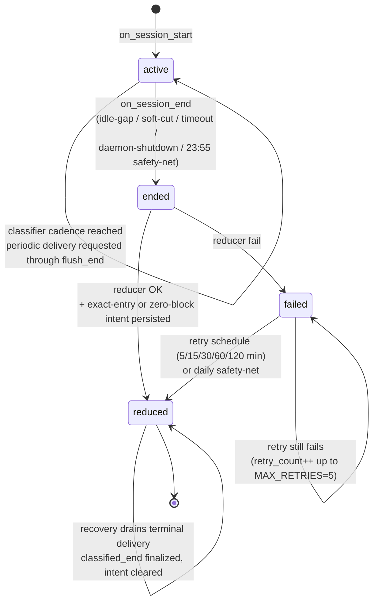

# Session

A "session" is a bounded chunk of focused work. OpenChronicle's writer pipeline is driven by session boundaries: the reducer writes incremental *flush* entries every 5 minutes while the session is active, periodic classifier delivery starts after 30 minutes of proven flush coverage by default, and the terminal reducer persists an exact-entry or proven-empty classification intent when the session closes. `flush_end` is reducer materialization progress. `classified_end` is advanced only when a durable classifier receipt is finalized. Reducer entry materialization is replay-idempotent, and classifier work survives callback loss or restart in the `classifier_jobs` outbox.

## Three cut rules

Implemented in `session/manager.py`, enforced in `check_cuts()` and on every `on_event()`. All times are local.

### 1. Hard cut (idle gap)

If no capture-worthy event has arrived for `session.gap_minutes` (default **5**), the session ends at the last event's timestamp.

> Rationale: lunch / phone call / real break. The gap itself isn't work, so the session ends *where* work paused, not *when* you came back.

### 2. Soft cut (single unrelated app)

If one unrelated app has held focus for `session.soft_cut_minutes` (default **3**) *and* frequent-switching is **not** active, the session ends.

> "Frequent-switching" = ≥2 distinct apps were focused in the last 2 minutes. Prevents the soft cut from firing during fast multi-app work (e.g. IDE + terminal + browser reference).

### 3. Timeout

A session older than `session.max_session_hours` (default **2**) is force-cut regardless of activity. Safety net against runaway sessions.

## Session state machine



Rows live in the `sessions` table (see [writer.md](writer.md#sessions-table)).
`flush_end` tracks the last materialized reducer boundary so the next flush (or
terminal reduce) covers only new timeline blocks. `classified_end` is the
highest contiguous classifier window with a durable receipt. The classifier
job lifecycle is independent of `sessions.status`, so an active or reduced
session may temporarily own a `pending`, `running`, `failed`, or `committed`
delivery.

Each active row also records the owning daemon PID and a per-process instance
token. On startup, the singleton daemon lease is stronger evidence than a bare
PID: rows from another process token are ended idempotently even if the OS has
reused the old PID. Direct/library callers without that lease remain
conservative and protect rows owned by a live process. Recovery ends rows at a
safe inferred boundary, preferring the latest persisted timeline evidence and
never ending before their start, after the restart, after a later session
begins, or beyond `max_session_hours`. This makes a row left by `SIGKILL`
eligible for the normal pending-reduction path.

## Flush tick (incremental reduce)

While a session is still `active`, a daemon task wakes every `session.flush_minutes` (default **5**, clamped to a 5-min floor to keep LLM cost bounded) and:

1. Snapshots the active `(session_id, session_start)` atomically.
2. Queries closed timeline blocks in `[flush_end or session_start, now)`.
3. If any new blocks exist, runs the reducer with `is_final=False` and appends a `[flush]`-tagged entry to today's `event-YYYY-MM-DD.md`.
4. Advances `flush_end` to the newest block boundary.

The classifier does **not** fire per flush. Once the gap from `classified_end`
(or session start) to durable `flush_end` reaches `classifier.interval_minutes`,
the delivery loop requests that exact proven range. Terminal reduction records
a separate exact-entry intent for the tail. Flush failures are logged but not
retried — the next tick covers a bigger window, and the terminal reduce is the
authoritative one.

Why 5-min minimum: the timeline stage is a verbatim-preserving normalizer, not a summarizer, so its blocks are narrow (default 1 min). A sub-5-min flush would mean many LLM calls over tiny block batches; at 5 min the flush consumes ~5 timeline blocks per call.

Flush and terminal reduction for the same session share a session-scoped BSD
file lock, so the daemon safety-net, async callback, and CLI catch-up cannot run
that job concurrently across threads or processes. Terminal entries also use a
deterministic entry ID: replay after a crash reuses the Markdown entry and
repairs a missing FTS projection instead of appending it twice.

Reducer publication also carries a content-generation fence. Timeline/memory
cleanup bumps that generation under the same review-operation lock used for
entry publication. A reducer that read the old generation is therefore rejected
before it can append/repair an entry or advance `flush_end`/terminal intent.

## Wiring

`session/tick.py::build_manager` returns a `SessionManager` with three callbacks wired:

- **`on_session_start`** — persists an `active` row immediately. A crash mid-session leaves a recoverable trace.
- **`on_session_persist`** — synchronously marks the row `ended` for every close path.
- **`on_session_end`** — normally spawns `reduce_session_async` and returns its thread handle to the manager. Terminal-reduce success stores the final entry ID/path or a typed zero-block proof, plus `classifier_terminal_pending=1`, before its `on_done` callback asks the durable delivery worker to run. Graceful daemon shutdown suppresses new dispatch after persistence and joins every reducer dispatched by an earlier natural cut before releasing the singleton lease; the next boot's pending reducer handles the newly ended shutdown row. Recovery does not depend on the callback.

Five daemon tasks back this up:

- **`run_check_cuts`** — every `session.tick_seconds` (default 30s), calls `check_cuts()` so idle-gap and timeout cuts fire even when no events are arriving.
- **`run_flush_tick`** — every `session.flush_minutes` (default 5), runs the reducer over the active session's new blocks and advances `flush_end`.
- **`run_classifier_tick`** — polls every 5–60 seconds, requests periodic coverage only after the configured cadence has accumulated behind durable `flush_end`, recovers terminal intents, and drains due/expired jobs. A receipt plus finalization, not the scheduler tick, advances `classified_end`.
- **`run_pending_reduction_tick`** — every 60s retries ended rows after the durable timeline watermark reaches the bucket containing their final event. A callback that arrives too early remains queued instead of being silently finalized.
- **`run_daily_safety_net`** — at local `reducer.daily_tick_hour:minute` (default 23:55), force-ends the currently-open session and runs `reduce_all_pending` to catch anything stranded at `ended`/`failed`.

## Classifier recovery boundary

Periodic and terminal requests deliberately prove different things:

- A periodic job is bounded by `flush_end` and selects reducer entries whose
  `oc-window-end` coverage tags fall in `(window_start, window_end]`. This
  prevents the classifier bookmark from outrunning Markdown materialization.
- A terminal job is bound to the exact deterministic final entry ID and its
  authoritative path. This matters for short sessions, cross-midnight sessions,
  and final entries whose display timestamp does not fall neatly inside the
  trailing range. Terminal intent is cleared only when that same entry ID's job
  succeeds, fencing a stale completion from clearing newer work.
- An empty terminal delivery is not inferred from a missing file or entry ID.
  It is allowed only when the reducer has persisted a zero-block terminal proof
  and there is no flush prefix, or the classifier cursor already covers that
  prefix through `flush_end`. The resulting terminal job accepts only the typed
  `EMPTY_TERMINAL_SKIP` (`proven_empty_terminal`) receipt with no summary,
  candidates, paths, or written IDs. Any unproved empty tail remains pending or
  fails closed.

Requests are serialized per session in `classifier_jobs`. A worker claims one
with a token/expiry lease, renews around provider calls, and persists a typed
commit-or-skip receipt before it advances `classified_end`. Expired workers are
fenced from proposal and commit transactions; a new worker may reclaim the job.
If restart finds `committed`, it finalizes the bookmark without calling the
model again. If it finds an unreceipted `running` lease after expiry or a due
`failed` row, it retries the same deterministic job/window. An unchanged
evidence snapshot reuses its digest-derived run identity. If valid late
evidence changed after the failed, uncommitted turn, the job atomically rebinds
to a new digest/run identity and marks old pending proposals as conflicts;
mid-flight changes still fail closed. See
[writer.md](writer.md#durable-delivery-state-machine) for the full contract.

## CLI

```bash
openchronicle writer run        # catch up any pending sessions + classify
```

This is the same reducer and classifier recovery path used by the daemon. It is
safe to run at any time: reducer materialization has deterministic entry IDs,
and classifier delivery uses its durable state machine and stable proposal
identity. This does not imply exactly-once model invocation; a crash before a
receipt can repeat a provider call while fenced/idempotent local effects remain
safe.

## Tuning

Almost every session-boundary complaint is one of these:

| Symptom | Knob |
|---|---|
| Sessions cut too eagerly during real focused work across multiple apps | `session.soft_cut_minutes` up (3 → 5), or leave it — the frequent-switching exception already handles most of these. |
| Sessions cut too late after idle (event-daily entries span more than the actual work) | `session.gap_minutes` down (5 → 3). |
| A single deep-work session grew past 2h and got chopped in half | `session.max_session_hours` up (2 → 4). You rarely want to disable this. |
| `check_cuts` feels laggy | `session.tick_seconds` down (30 → 10). Cost is negligible — the check is just arithmetic. |

## Why not write per-capture?

V1 did. Two production failure modes pushed v2 to session-level:

1. **Long sessions under-reported.** Once the writer had appended an entry about app X, every subsequent capture of app X triaged to "already recorded" — a 28-minute session would land as a 3-minute "user played a few minutes" entry. The dedup layer saved on tokens but lost the tail.
2. **Event files conflated days.** The old weekly rollup accumulated a whole week of user-stated facts + activity. A "what did I do today?" query had to scan 7 days.

Session-level writes make long work correct by construction (the reducer sees every timeline block in the range and prints an explicit time range), and `event-YYYY-MM-DD.md` is a one-file-per-day boundary that trivially answers day-scope queries.
